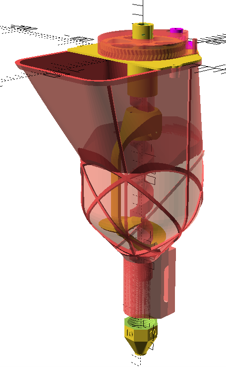

# Concrete extruder based around a hopper and auger

Mostly 3D printed, using a steel wood drill bit as the auger, and a steel pipe as the mixing tube.

The design is OpenSCAD with the BOSL2 library.

## Hardware Requirements
The main body of the extruder is the 3D printed hopper.

NEMA 17 stepper motor turns the auger via a 3D printed geartrain.

A steel auger pushes material down out of the hopper.  This is an 18 inch long (original before cutting) wood drill bit, cut off at the tip, keeping only the 7/16" hex (11mm across the flats) drive section and spiral used for material transport.

The 3D printed inducer stirs material in the hopper to keep it in contact with the auger. 

The auger runs through a steel mixing tube before the nozzle.  The tube is a 4 inch (shorter overall printer) or 6 inch length (longer auger region, possibly more backpressure) 1 inch nominal ID steel pipe, with pipe threads on both ends.

## Performance

Initial test results from printing mud (basalt dust and bentonite clay) and a geopolymer mortar (fly ash and alkali):
- The printed material should be viscous but flow easily. Too sandy and the nozzle will pack solid.
- Maximum aggregate size should be 1/8" (3mm, #8 mesh), large aggregates wedge the auger against the pipe.
- In tacky material, the auger just cuts straight down through the material, hence the inducer spiral to push material down out of the hopper.

If you print this in PLA, it will work fine printing mud, but the strong alkali of concrete or mortar will crack the printed parts in under an hour. I recommend printing the parts from PETG or ABS.

