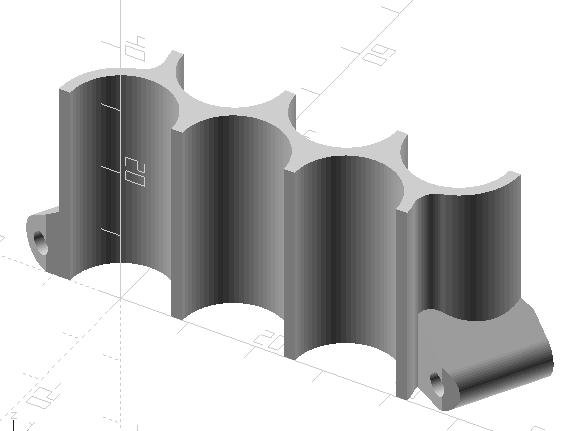

# Stackable Honeycomb Test Cylinder Gang Mold

This gang mold casts 15mm x 30mm test cylinders from mortar or concrete-like materials. Print at least two copies of this and string them onto 3mm rods like bamboo skewers or 3mm printer filament. Each additional mold adds three more cylinders, for many tests in a small space.

It's designed to make many test cylinders easily.  Each cylinder has volume of about 5mL, so about 10 grams (dry weight) of concrete should fill each one.  The shape is a 1/10 scale model of the full-size ASTM C39 unconfined compressive test cylinder. 

The separate pieces do tend to expand a little as you add concrete to them, which leaves a small ridge in the finished cylinder.  Adding an elastic band around the outside of the mold segments will hold them together.

This model is free to download, use, and modify.

